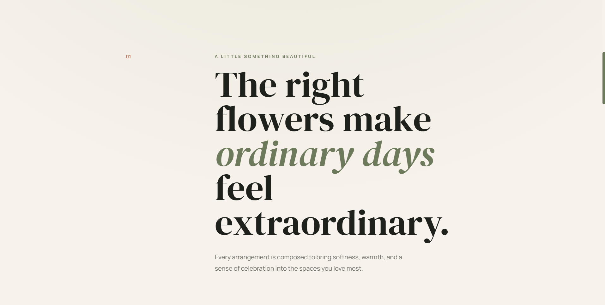
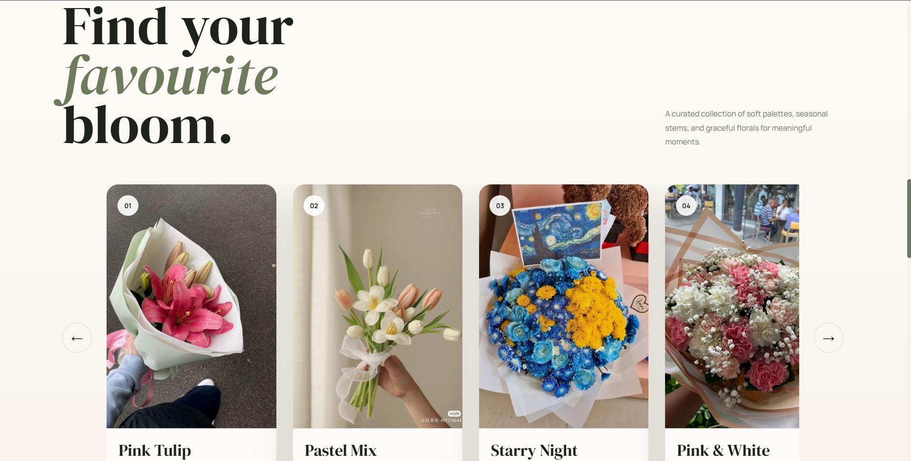
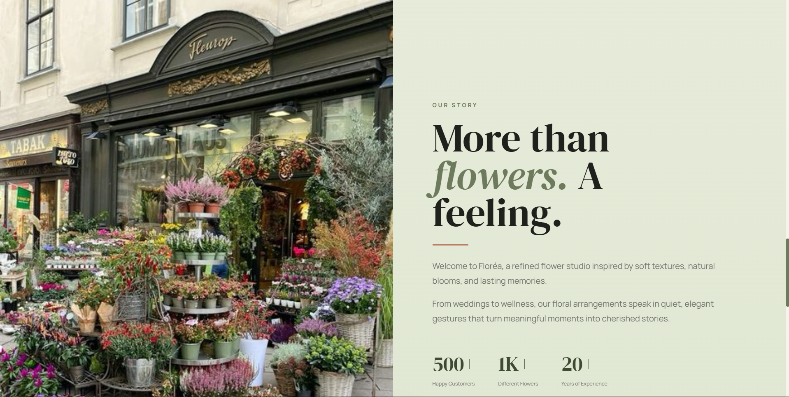
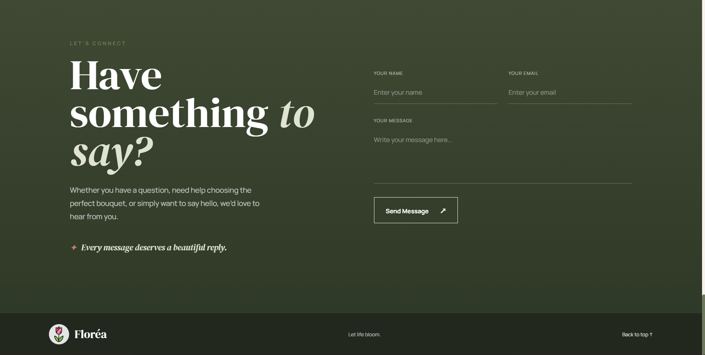

# 🌿 Floréa — A Refined Floral Studio

A beautiful, responsive floral studio website inspired by soft textures, natural blooms, and lasting memories.

Floréa is designed around the idea that the right flowers can make ordinary days feel extraordinary. The website presents a curated collection of elegant blooms, a refined studio story, and a simple way for visitors to get in touch.

## 🌐 Live Demo

<a href="https://florea-flowers-studio.vercel.app/" target="_blank">View Live Website ↗</a>

## ✨ Features

* Elegant and responsive floral studio design.
* Full-screen hero section with background video.
* Smooth navigation between website sections.
* Curated flower collection with horizontal scrolling.
* Interactive previous and next gallery controls.
* Responsive mobile navigation menu.
* About section featuring the Floréa story and studio statistics.
* Contact form with name, email, and message fields.
* Responsive layout for desktop, tablet, and mobile devices.
* Modern hover effects and smooth transitions.
* Clean and beginner-friendly project structure.

## 🛠️ Technologies Used

* **HTML5** — Semantic website structure
* **CSS3** — Responsive layouts, animations, transitions, and visual styling
* **JavaScript** — Gallery navigation and mobile menu interactions

## 📸 Website Preview
> **LET LIFE BLOOM**

<p align="center">
  
</p>
> **Flowers that feel like poetry.**
<p align="center">
  
  
</p>
> **More than flowers. A feeling.**
<p align="center">
  
  
</p>

### 📊 Studio Highlights

* **500+** Happy Customers
* **1K+** Different Flowers
* **20+** Years of Experience

### 💌 Contact

Visitors can get in touch with Floréa through the contact form for questions, bouquet assistance, or simply to say hello.

> Every message deserves a beautiful reply.

## 📂 Project Structure

```text
FLOREA-flowers-studio/
│
├── index.html
├── main.css
├── .gitignore
│
├── screenshots/
│   ├── screenshots1.gif
│   ├── screenshot2.png
│   ├── screenshot3.png
│   ├── screenshot4.png
│   └── screenshot5.png
│
└── images&videos/
    ├── flowers.mp4
    ├── tuliplogo.png
    ├── pink flower.jpg
    ├── small tulips.jpg
    ├── stary nyt flower.jpg
    ├── pink white flower.jpg
    ├── sunflower.jpg
    ├── blueflower.jpg
    └── shop flower.jpg
```

## 🚀 Getting Started

### 1. Clone the repository

```bash
git clone https://github.com/NARESHGUPTA0912/FLOREA-flowers-studio.git
```

### 2. Open the project folder

```bash
cd FLOREA-flowers-studio
```

### 3. Run the website

Open `index.html` directly in your browser.

For a better development experience, you can also use the **Live Server** extension in VS Code.

## 🎯 Purpose

This project was created to practice and strengthen frontend development fundamentals by building a complete floral studio website from scratch.

Through this project, I practiced:

* Structuring webpages with HTML5
* Creating responsive layouts with CSS3
* Working with background videos and images
* Designing a modern user interface
* Creating smooth animations and transitions
* Implementing interactive gallery controls
* Building a responsive navigation menu
* Writing basic JavaScript interactions
* Deploying a static website online

## 👨‍💻 Author

Created by **Naresh Gupta** as a frontend development practice project.

## 📄 License

This project is available for learning and educational purposes.

Feel free to explore and customize the code for your own practice.
